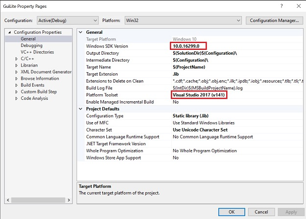

# How to build & port GuiLite?
## How to build GuiLite libary for Windows?
Prerequisite: Windows & Visul Studio 2013/2015/2017/2019
- Open "GuiLite.sln" by Visual Studio
- Click `Build Solution`
- Output here: \GuiLite\Debug(Release)\GuiLite.lib

FAQ: Error when open GuiLite project with Visual Studio, reconfigure the project to match your computer like this:

## How to build GuiLite libary for iOS/Mac and Linux(amd64) & raspberry pi?
- `cd GuiLite`
- `cmake .`
- `make`
- Output here: /GuiLite/libGuiLite.a

## How to build GuiLite libary for ARM Linux?
### Prerequisite: Install cross compiler:
- For ARM32: `sudo apt-get install g++-arm-linux-gnueabi gcc-arm-linux-gnueabi`
- For ARM64: `sudo apt-get install g++-aarch64-linux-gnu gcc-aarch64-linux-gnu`
### Build
- `cd GuiLite`
- For ARM32: `cmake -D CMAKE_C_COMPILER="/usr/bin/arm-linux-gnueabi-gcc" -D CMAKE_CXX_COMPILER="/usr/bin/arm-linux-gnueabi-g++" .`
- For ARM64: `cmake -D CMAKE_C_COMPILER="/usr/bin/aarch64-linux-gnu-gcc" -D CMAKE_CXX_COMPILER="/usr/bin/aarch64-linux-gnu-g++" .`
- `make`
- Output here: /GuiLite/libGuiLite.a

## How to build GuiLite libary for Android?
### Prerequisite: Install cross compiler:
`sudo apt-get install gcc-arm-linux-androideabi` 
### Build
- `cd GuiLite`
- `cmake -D CMAKE_C_COMPILER="/usr/bin/arm-linux-androideabi-gcc" -D CMAKE_CXX_COMPILER="/usr/bin/arm-linux-androideabi-g++" .`
- `make`
- Output here: /GuiLite/libGuiLite.a

## How to build GuiLite libary for any MCU?
### Prerequisite: Install Keil uvsion 5.6 or above.
### Build
- Open `GuiLite.uvprojx` with Keil uvsion.
- Implement function(e.g, thread_sleep) in `core\src\adapter\api_unknow.cpp` to meet your need.
- Choose your Device type(Default: STM32F103ZE) from option for target.
- Build GuiLite.
- Output here: /GuiLite/Objects/GuiLite.lib

## How to port?
Here are 2 options for porting. 

### Option 1: 1 Header & 1 Source
1. Execute `1h-1cpp.sh` to merge the whole source code into: 1 header(GuiLite.h) & 1 source(GuiLite.cpp)
2. Move GuiLite.h/GuiLite.cpp to your project
3. Rebuild your project

### Option 2: Headers & 1 Library
- Headers: core_include, widgets_include
- Library: The GuiLite library
1. Move core_include/widgets_include to your project
2. Build GuiLite library by above building process
3. Link GuiLite library to your project
4. Rebuild your project

We recommend option 1, because of:
- Easy to port - no need to buid library
- Easy to move - just 2 files
- Easy to manage header files - just 1 header file
- Easy to debug - no library binary

On the other hand, for option 2: you should build GuiLite library, and move all headers files & library to your project.
