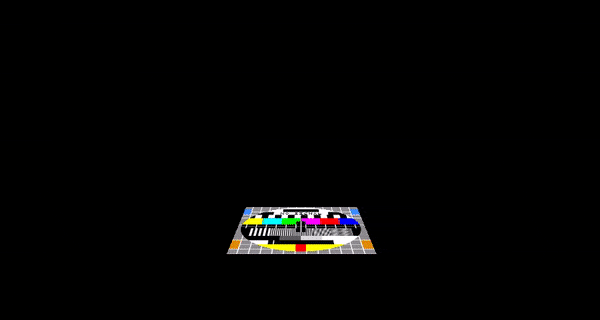

# GuiLite设计原理及代码注释
- [基本原理](#基本原理)
- [扩展方法](#扩展方法)
- [代码目录结构](#代码目录结构)
- [界面元素管理](#界面元素管理)
- [图形绘制](#图形绘制)
- [文件注释](#文件注释)
- [函数注释](#函数注释)
- [速成路线图](#速成路线图)
***
## 基本原理
GuiLite只作两个工作：界面元素管理和图形绘制。

界面管理包括：
- 添加/删除界面元素（例如：按钮，标签，对话框等控件），设置对应的文字及位置信息
- 用户输入消息传递：根据用户输入寻找受影响的界面元素，并回调响应的处理的处理函数
- 用户自定义消息传递：用户可以自定义消息响应函数，并自主产生消息；当消息产生时，对应的响应函数会被调用

图形绘制包括：
- 基本的点线绘制，例如：画点，矩形，横线，竖线等
- 设置绘制图层，如果需要多个图层，在基本点线绘制时，需要给出图层的索引值
- 图层处理，在图层界面发生变化的时候(例如：打开/关闭对话框)，GuiLite将决定各个图层上的像素点，哪个会被最终显示在屏幕上

👉注意：图形绘制不依赖界面管理，可以独立的存在，例如，在资源有限的单片机环境，有时候不需要界面元素管理，而直接进行图形，文字的绘制。

## 扩展方法
GuiLite只给出了基本控件（例如：按钮，标签，键盘，选择框）的实现方法，旨在说明控件的实现方法。对于扩展控件，可以选择下面的方式：
- 如果开发者需要调整基本控件的细节，可以直接在源代码中修改
- 如果开发者需要构建全新的控件，可以参考基本控件的实现方法，重新实现

对于扩展绘制，例如：画圆，画曲线，可以直接在surface.cpp文件中添加响应的函数接口。

## 代码目录结构
core: 
- 实现了底层绘制，图层管理和消息传递
- adapter实现了各个平台（例如：Windows, Linux，Android，iOS，macOS,未知OS或无OS）的封装。

widgets: 
- 实现了各种常规控件（例如：按钮，标签，键盘，波形）及容器（例如：视窗，对话框，滑动页面），开发者可以根据自己的需要，直接在相应的代码上进行修改或重绘，开发出有自己风格，特色的界面
- 实现了用户的手势识别（例如：手指滑动，鼠标按下/释放）的消息传递，将用户的输入信息传递到整个GUI体系树中，并调用相应的响应回调函数；开发者可以根据自己的需要添加/修改响应回调函数。

## 界面元素管理
界面元素管理包括：对所有控件（button，spinbox, lable, keyboard），容器（dialog, view）管理；具体的管理方法是在用户调用connect函数时，会把所有的界面元素连接起来，从而实现对所有界面元素的遍历/添加/删除等操作。这些链接看起来像一棵树，对界面元素的遍历，就是对这棵树的遍历

比如：当你按下一个dialog的button时，手指的位置信息（x，y）会被传入树的根部（root），然后从root开始寻找，哪个dialog被点中，dialog的哪个button被点中，并调用buton被点中的回调函数，用于作相应处理（一般会进行button的状态修改及重绘工作）

### 界面元素如何创建
所有界面元素都继承自c_wnd类的对象，对象被实例化时，也就完成了界面元素的创建；但此时的界面元素是孤独的，与其他界面元素没有形成联系（没有父母，没有兄弟姐妹）

### 界面元素如何被管理
新创建的界面元素纳入管理的过程，就是为其添加父母，兄弟姐妹的过程。使用的函数接口为connect();从此该界面元素会跟其他界面元素一样，纳入一棵树中，并随之响应用户可能的点击操作。

当需要删掉该界面元素时，使用disconnect()；从此该界面元素会断绝所有的父子关系，从树上摘下来，不再响应用户的触控操作；但对象本身不会被销毁。典型应用场景：软键盘的创建/退出。

## 图形绘制
图形绘制包括： 绘制方法和图层管理。
- 点绘制是线/面/位图绘制的基础，若干个点的绘制，形成点面及位图
- 图层管理，则是管理多个界面元素的遮挡关系，系统默认支持3层遮挡关系，这3个层次可以为：视图背景层，对话框层，keyboard/spinbox控件层。

### 绘制方法
请参看文件bitmap.cpp和surface.cpp中的draw_xxx()函数。
为了发挥GPU的加速功能，也可以通过改写draw_xxx/fill_xxx函数，使用GPU特性，来提升绘制效率。

### 图层管理

- display层：该层对应了物理显存，display层决定了一个显示终端的最终显示效果；通常系统中至少有一个display层。
- surface层：该层属于display层的一个部分；它为左右滑动而存在，每一张滑动页面均对应了一个surface层；surface层决定了一个滑动页面的最终显示效果；通常1个display层会对应多个surface层。
- frame层：该层属于surface层的一个部分；它现实叠加界面元素而存在。

## 文件注释
| core 重要程度/文件名称 | 代码简介 | 推荐学习时间 |
| --- | --- | --- |
| ★★★ wnd.cpp | UI元素的基本类，定义所有的UI元素信息、绘制及管理办法 | 1.5小时 |
| ★★ cmd_target.cpp | 映射UI消息及用户自定义的消息 | 0.5小时 |
| ★★ display.cpp | 生成显示设备，设定surface的数目，一个surface对应一个滑动页面 | 0.5小时 |
| ★★ surface.cpp| 实现像素点的绘制，并对各个图层（layer）进行管理 | 0.5小时 |
| word.cpp | 显示文字 | < 1小时 |
| bitmap.cpp | 绘制位图，支持16 bits和32 bits | < 0.5小时 |
| rect.cpp | UI元素的位置信息 | < 0.5小时 |
| api_linux.cpp | Linux适配层 | < 0.5小时 |
| api_win.cpp | Window适配层 | < 0.5小时 |
| api_unknow.cpp | 无OS或其他OS适配层 | < 0.5小时 |
| audio_linux.cpp | Linux audio适配层 | < 0.5小时 |
| audio_win.cpp | Windows audio适配层 | < 0.5小时 |
| msg_linux.cpp | 消息管道在Linux上的实现 | < 0.5小时 |
| msg_win.cpp | 消息管道在Windows上的实现 | < 0.5小时 |
| msg_unknow.cpp | 消息管道在其他OS（或无OS）上的实现 | < 0.5小时 |
***
| widgets 难度/文件名称 | 代码简介 | 推荐学习时间 |
| --- | --- | --- |
| label.cpp | 标签控件的绘制 | < 0.5小时 |
| button.cpp | 按钮控件的绘制及用户点击响应函数 | < 0.5小时 |
| table.cpp | Table控件的绘制 | < 0.5小时 |
| dialog.cpp | 对话框的绘制及管理方法 | < 0.5小时 |
| ★ gesture.cpp | 手势识别方法，包括：鼠标按下，弹起及滑动 | 0.5小时 |
| ★ keyboard.cpp | 键盘控件的绘制及用户点击响应函数 | 0.5小时 |
| ★★ list_box.cpp | List控件的绘制及用户点击响应函数 | 1.5小时 |
| ★★ spinbox.cpp | Spinbox控件的绘制及用户点击响应函数 | 1.5小时 |
| ★★ edit.cpp | Edit控件的绘制及用户点击响应函数 | 1.5小时 |
| ★★★ wave_buffer.cpp | 波形数据的缓冲管理 | 1.5小时 |
| ★★★ wave_ctrl.cpp | 实现波形控件 | 1.5小时 |

## 函数注释
| 函数名称 | display.cpp 函数接口注释 |
| --- | --- |
| c_display | c_display构造函数。phy_fb：物理framebuffer指针；display_width：物理显示器宽度；display_height：物理显示器高度；surface_width：surface宽度；surface_height：surface高度；color_bytes：颜色深度；surface_cnt：surface个数/滑动页面的个数；gfx_op：外部绘制接口，用以适配非framebuffer的渲染方式，如果该值不为空，surface在作底层渲染的时候，会调用该接口 |
| alloc_surface | 分配surface/滑动页面。usr： 用户ID；max_zorder：该surface所拥有的图层数量|
| merge_surface | 横向组合两个surface，多用于滑动surface。s0：源surface 0；s1：源surface 1，x0：源surface 0的起始点x坐标；x1：源surface 1的起始点x坐标；y0：源surface 0的起始点y坐标；y1：源surface 1的起始点y坐标；offset：横向组合的偏移距离 |
| get_updated_fb | 获取该display的framebuffer指针，常用来将GUI显示在任意需要的地方。widght：用来获取framebuffer的宽度；height：用来获取framebuffer的高度；force_update：是否需要强制更新framebuffer的内容，如果不需要强制更新，且framebuffer没法发生变化，将返回NULL |
| snap_shot | 生成当前显示的快照，并输出到bitmap文件。file_name：快照文件的名称 |
***
| 函数名称 | surface.cpp 函数接口注释 |
| --- | --- |
| c_surface | c_surface构造函数。 display：surface所属于的display；width：surface的宽度；height：surface的高度；color_bytes：颜色深度|
| set_surface | 设置surface。wnd_root：使用者者ID，通常为root window，其子窗口自动获得该surface的使用权。 max_z_order：该surface拥有的图层数量 |
| draw_pixel | 渲染一个像素点。x：像素点坐标x；y：像素点坐标y；rgb：像素颜色；z_order：像素所在的图层 |
| draw_pixel_on_fb | 渲染一个像素点 - 底层渲染。x：像素点坐标x；y：像素点坐标y；rgb：像素颜色 |
| fill_rect | 填充一个矩形。 x0：矩形左上角的坐标x；y0：矩形左上角的坐标y；x1：矩形右下角的坐标x；y1：矩形右下角的坐标y；rgb：矩形的颜色；z_order：矩形所在的图层|
| fill_rect_on_fb | 填充一个矩形 - 底层渲染。 x0：矩形左上角的坐标x；y0：矩形左上角的坐标y；x1：矩形右下角的坐标x；y1：矩形右下角的坐标y；rgb：矩形的颜色 |
| get_pixel | 获取指定位置的像素点的颜色值。x：位置坐标x；y：位置坐标y；z_order：位置坐标z（图层坐标） |
| draw_hline | 渲染一条横线。x0：横线的左边起始坐标x；x1：横线的右边结尾坐标x；y：横线的纵向坐标y |
| draw_vline | 渲染一条竖线。x：竖线的横向坐标：x；y0：竖线的上起始坐标y；y1：竖线的下结尾坐标y |
| draw_line | 渲染普通直线。x1：直线左端点的坐标x；y1：直线左端点的坐标y；x2：直线右端点坐标x；y2：直线右端点坐标y |
| draw_rect | 渲染矩形。x0：矩形左上角的坐标x；y0：矩形左上角的坐标y；x1：矩形右下角的坐标x；y1：矩形右下角的坐标y |
| set_frame_layer_visible_rect | 设置指定图层的可视区域（矩形），可视区域会根据图层优先级，自动进行上下叠加。rect：可视矩形的位置信息；z_order：图层的z坐标（图层坐标） |
| flush_screen | 将当前surface的指定矩形区域一次性刷在显示屏上。left：surface指定区域的左边界坐标；top：surface指定区域的上边界坐标；right：surface指定区域的右边界坐标；bottom：surface指定区域的下边界坐标 |
| is_valid | 判断给定位置的矩形，是否合理（是否在surface的范围内）。rect：矩形区域的坐标信息 |

## 速成路线图
1. 精读源文件wnd.cpp中的connect, on_touch, on_key函数，理解界面元素的串联办法；理解响应触控操作的基本原理；理解响应硬按键的基本原理
2. 快速浏览surface.cpp中用于绘制的draw_xxx函数，熟悉基本的绘制接口；精读c_surface构造函数，理解c_surface类的各种成员关系
3. 精读button.cpp文件，初步掌握界面元素的基本开发方法
4.  - 快速浏览HelloStar实例的BuildLinux/main.cpp，理解构建一般Linux应用的办法
    - 快速浏览HelloStar实例的BuildMFC/HelloStarDlg.cpp，理解构建一般Windows应用的办法
    - 快速浏览HelloStar实例的BuildSTM32F103-Keil/USER/main.c，理解构建一般单片机系统的办法
